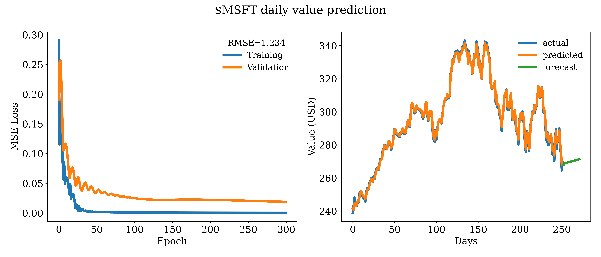

# Using LSTMs to predict stock prices

<!-- - [ ] Add a description of LSTMs and how they're used here to generate these predictions.
- [ ] Add a short explanation of the results and the quality of the fit.
- [ ] Add a description of caveats e.g. the network trains on historical data, and thus it is prone to predict the historical trend of the stock. -->

