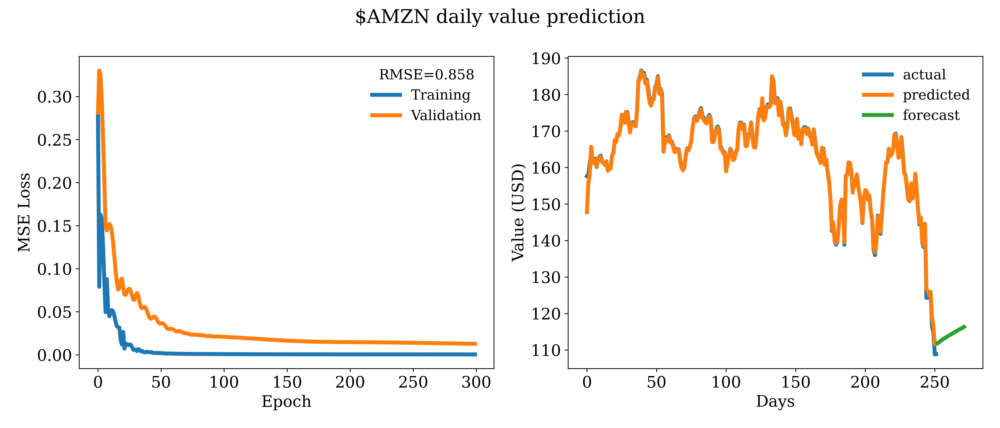

# Using LSTMs to predict stock prices

Long term short memory (LSTM) networks are a type of artificial neural network that have been shown to be rather effective at classification and prediction of time series data.

Originally designed to resolve issues that emerge from the computational limitations of reccurent neural networks (see [the vanishing gradient problem](https://en.wikipedia.org/wiki/Vanishing_gradient_problem)
), LSTM networks feature an architecture that allows information to persist, thus enabling the use of knowledge from prior states when computing the current state.

In the present example, LSTM networks are used to fit the time series data of stock prices, and make short term future predictions on the value. The figures in this article were generated with data from the past five years for the relevant tickers pulled from Yahoo Finance. The model was trained on four years worth of data, and then used to make predictions on the remaining one year.

As can be seen below, the model does a good job at predicting the testing data, which is fantastic given that there is only one parameter. Interestingly, the model performs well even though the current financial year (2022) has been rather unprecedently tumultuous for the stock market as a whole, but especially the tech sector.

## Current limitations

As it stands, the network is trained on data that is normalized over the entire dataset. In other words, local effects on the stock price are not taken into account, which can affect the quality of the predictions, as they can be biased by historical trends. These effects are usually reflected in the trading volume or the behaviour of the broader market, and will eventually be added as parameters of the model.
